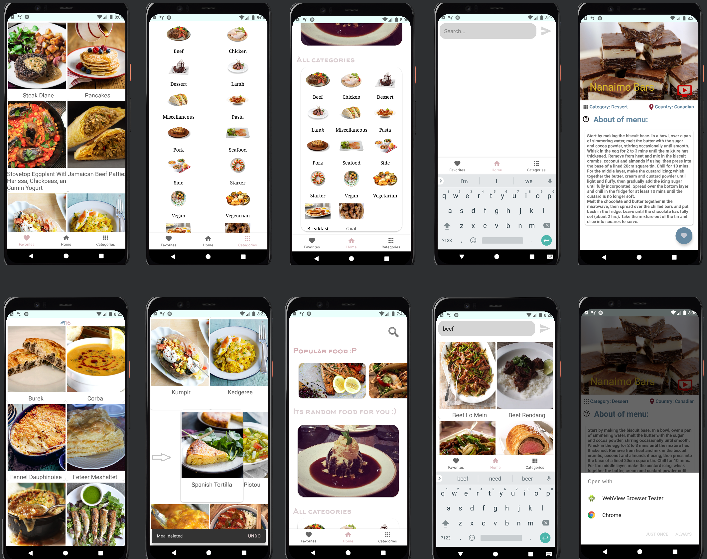

# Tranquility Food

***

__Tranquility Food__ is a companion in the world of culinary recipes. With this application you will brighten up your magnificent evening :)

***

# Screenshots

***

# Libraries and technologies used

* Navigation component : one activity contains multiple fragments instead of creating multiple activites.
* MVVM & LiveData : separate logic code from views and save the state in case the screen configuration changes.
* View Binding : instead of inflating views manually view binding will take care of that.
* Figma : build UI/UX model
* Coroutines : do some code in the background.
* Retrofit : making HTTP connection with the rest API and convert meal json file to Kotlin/Java object.
* Room : save meals in local database.  
* Splash Screen: launch the welcome screen  
* Glide : catch images and load them in imageView.